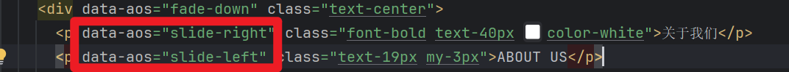

# 生命周期说明
> 1.插件、路由中间件、路由校验（介于初始化插件后与执行路由中间件之间执行）在客户端、服务端都会执行，实际业务中，需通过import.meta.xxxx进行判断

# 性能
> 1.能使用composables就别使用plugin，因为plugin在水合阶段执行的（会阻塞服务端页面渲染），而composables在组件初始化阶段执行的 \
> 2.合理使用plugin的并行异步加载（parallel: true），可以并行加载多个plugin，提高页面加载速度 \
> 3.有链接跳转或路由跳转时，建议使用NuxtLink标签替代Router、<a />,因为其可以设置预加载时机、预取等属性，提高用户体验 \
> 4.合理利用混合渲染 \
> 5.利用延迟加载组件、组件惰性水合提高服务端水合效率 \
> 6.使用useFetch、useAsyncData确保在服务器端、客户端都执行的环境下，只在服务端请求一次api（后端仅收到一次请求） \
> 7.使用NuxtImg标签替代img标签，因为其可以自动进行分辨率转换，提高页面加载速度、清晰度 \
> 8.使用NuxtLayout标签替代Layout标签，因为其可以设置布局切换动画，提高用户体验 \
> 9.移除无用依赖，因为它将增加项目的捆绑包大小
> 10.vue相关的性能，使用shallowRef、v-memo、v-once进行性能优化
```javascript
<template>
  <!-- 🚨 Needs to be loaded ASAP -->
  <NuxtImg
    src="/hero-banner.jpg"
    format="webp"
    preload
    loading="eager"
    fetch-priority="high"
    width="200"
    height="100"
  />

  <!-- 🐌 Can be loaded later -->
  <NuxtImg
    src="/facebook-logo.jpg"
    format="webp"
    loading="lazy"
    fetch-priority="low"
    width="200"
    height="100"
  />
</template>

```
# 项目版本升级
```javascript
npx nuxt upgrade --dedupe
```

# 整合AOS动画库
## 参考博文
链接:https://blog.csdn.net/gitblog_01118/article/details/154934278
## 安装依赖
```javascript
pnpm install aos
```
## 编写插件aos插件
app/plugins/aos.client.ts
### 方式一
```javascript
import AOS from 'aos';
export default defineNuxtPlugin(() => {
    /**
     * 方式一，每次都需要在需要使用的界面，进行以下初始化，麻烦
     
     */
    return {
         provide: {
             aos: () => AOS
         }
    }
})
```
#### 在需要的页面进行初始化
```javascript
import {useNuxtApp} from "nuxt/app";
const { $aos } = useNuxtApp()
onMounted(()=>{
    $aos().init({
        easing: 'ease-out-back',
        duration: 1000
    })
})
```
### 方式二
```javascript
import AOS from 'aos';
export default defineNuxtPlugin(() => {
    AOS.init({
        easing: 'ease-out-back',
        duration: 1000
    })
})
```
#### 直接在页面使用data-aos属性即可

## 动画类型说明
```javascript
淡入淡出类：fade、fade-up、fade-down、fade-left、fade-right等
翻转类：flip-up、flip-down、flip-left、flip-right
滑动类：slide-up、slide-down、slide-left、slide-right
缩放类：zoom-in、zoom-in-up、zoom-in-down、zoom-out等
```
## 注意事项
### 1.开发环境可能出现以下警告，功能正常，可以不用理会，也不影响正常打包，正常环境不会有警告

# 执行时机注意事项
> 1.在 script setup 中的代码，会在client、server都执行一次\
> 2.client、server都执行的情况下，要操作localStorage时，使用useCookie\
> 3.避免在SSR期间使用仅客户端条件 
```javascript
// 错误做法
<template>
  <div v-if="window?.innerWidth > 768">
    Desktop content
  </div>
</template>
//正确做法，使用媒体查询
<template>
    <div class="responsive-content">
        <div class="hidden md:block">Desktop content</div>
        <div class="md:hidden">Mobile content</div>
    </div>
</template>
```
> 4.对于有副作用的第三方库，要在客户端初始化完成时才引入，避免在服务端执行时引入，因为服务端没有window对象或DOM为加载完全的情况
```javascript
// 问题：修改 DOM 或具有浏览器依赖项的库（标签管理器经常发生这种情况）。
<script setup>
    if (import.meta.client) {
        const { default: SomeBrowserLibrary } = await import('browser-only-lib')
        SomeBrowserLibrary.init()
    }
</script>
// 解决方案：在水合完成后且浏览器端DOM初始化完成：
<script setup>
    onMounted(async () => {
        const { default: SomeBrowserLibrary } = await import('browser-only-lib')
        SomeBrowserLibrary.init()
    })
</script>
```
> 5.由于服务器端和客户端数据不一致的情况（针对客户端，服务端都执行的环境下，仅以最先执行的结果为准，不会重复进行执行）
```javascript
<template>
    <div>{{ state }}</div>
</template>
//使用useState进行处理，确保在客户端和服务端都有相同的随机数
<script setup>
    const state = useState('random', () => Math.random())
</script>

```
# 客户端、服务端判断条件
```javascript
if(import.meta.server){
    console.log('server')
}
if(import.meta.client){
    console.log('client')
}
```

# 中间件
## 中间件分类
### 全局中间件(以.global结尾)
例如：analytics.global.ts
### 命名中间件
例如：auth.ts
### 内联中间件
```javascript
<script setup lang="ts">
definePageMeta({
  middleware: [
    function (to, from) {
      // Custom inline middleware
    },
    'auth',
  ],
});
</script>

```
## 在plugin为Page动态设置中间件
```javascript
import type { NuxtPage } from 'nuxt/schema'

export default defineNuxtConfig({
  hooks: {
    'pages:extend' (pages) {
      function setMiddleware (pages: NuxtPage[]) {
        for (const page of pages) {
          if (/* some condition */ true) {
            page.meta ||= {}
            // Note that this will override any middleware set in `definePageMeta` in the page
            page.meta.middleware = ['named']
          }
          if (page.children) {
            setMiddleware(page.children)
          }
        }
      }
      setMiddleware(pages)
    }
  }
})

```
## 动态创建中间件
```javascript
export default defineNuxtPlugin(() => {
  addRouteMiddleware('global-test', () => {
    console.log('这个全局中间件是在插件中添加的，将在每次路由更改时运行')
  }, { global: true })

  addRouteMiddleware('named-test', () => {
    console.log('这个命名的中间件被添加到插件中，并将覆盖任何同名的现有中间件')
  })
})

```
## 路由中间件的返回值说明
> 1.直接return，相当于当前中间件不处理，继续执行下一个中间件，如果没有下一个，则放开导航\
> 2.return navigateTo('/')  重定向到给定的路径，并将重定向代码设置为302（如果重定向发生在服务器端）\
> 3.return navigateTo('/home', { statusCode: 301 })  重定向到给定的路径，并将重定向代码设置为301\
> 4.return abortNavigation()- 停止当前导航（没有任何反应）\
> 5.return abortNavigation(new Error('Custom error'))- 拒绝当前导航并出现自定义错误
## 执行顺序
全局中间件（有多个全局则按照字母顺序）》页面中间件（如果有多个则按照数组顺序）

# 开发环境Node版本
## node 22.18.0（最好是偶数版本）

# nuxt generate命令说明
## ssr设置为true

执行nuxt generate命令打包时，会请求后端接口生成静态html页面，具有SEO功能（只是打包此刻所获取的信息）

首次请求，返回的文档信息就是打包时获取的信息（不会实时更新，要更新需要重新打包）

可以看到，首次打开页面，都是获取的打包时请求后端接口获取到的静态内容，不会进行请求后端接口
## ssr设置为false

执行nuxt generate命令打包时，不会请求后端接口，跟平时我们用vue写的单页面应用一模一样

可以看到返回的文档都是空白的，而且首次打开页面，会直接实时请求后端接口


# 什么是水合
```javascript

<template>
 <div>
  <h1>{{ title }}</h1>
  <button @click="count++">点击次数: {{ count }}</button>
 </div>
</template>

<script setup>
 const title = '水合示例'
 const count = ref(0)
</script>

```
```javascript
服务端会生成
<h1>水合示例</h1>
<button>点击次数: 0</button>
这个HTML并返回给客户端，而在客户端中vue会找到这个按钮并添加点击事件监听器。
```

# Nuxt Minimal Starter

Look at the [Nuxt documentation](https://nuxt.com/docs/getting-started/introduction) to learn more.

## Setup

Make sure to install dependencies:

```bash
# npm
npm install

# pnpm
pnpm install

# yarn
yarn install

# bun
bun install
```

## Development Server

Start the development server on `http://localhost:3000`:

```bash
# npm
npm run dev

# pnpm
pnpm dev

# yarn
yarn dev

# bun
bun run dev
```

## Production

Build the application for production:

```bash
# npm
npm run build

# pnpm
pnpm build

# yarn
yarn build

# bun
bun run build
```

Locally preview production build:

```bash
# npm
npm run preview

# pnpm
pnpm preview

# yarn
yarn preview

# bun
bun run preview
```

Check out the [deployment documentation](https://nuxt.com/docs/getting-started/deployment) for more information.
